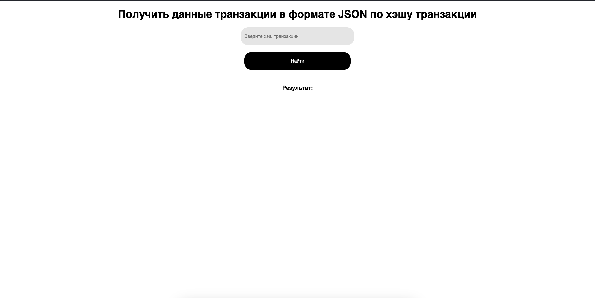

# Как установить и пользоваться

Для начала надо установить все зависимости, через следующую команду
# npm install

Далее надо создать файл .env в корневой папке, и создать поле NEXT_PUBLIC_KEY и задать ваш ключ проекта INFURA

# npm run dev для запуска (sudo npm run dev для MACOS)

затем в браузере надо набрать следующий адрес : localhost:3000

Результат должен быть таким

